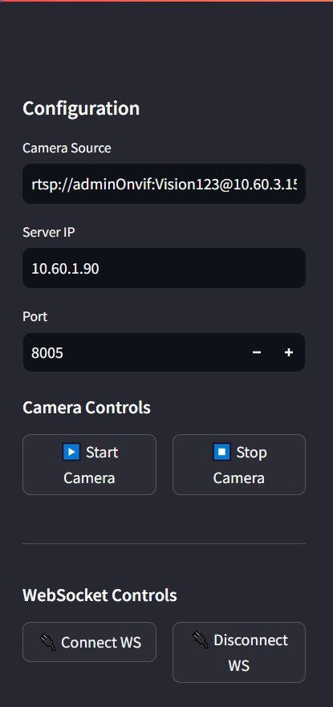
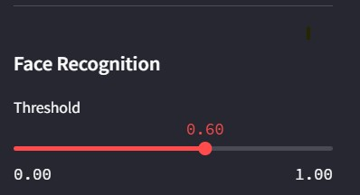
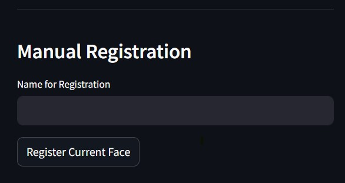
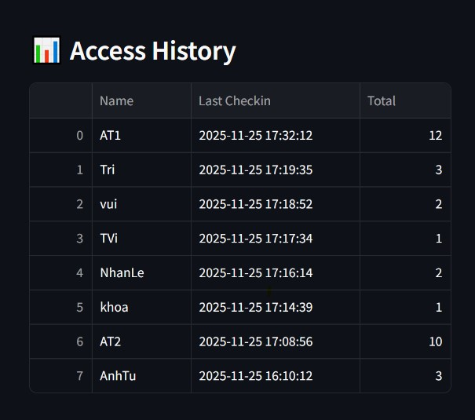

# Face Recognition — README

Short introduction, main components and build/run instructions for the Face Recognition system (Streamlit UI + native model wrapper).

**Main files & directories**
- `FaceRecognition-FAISS/`: Streamlit app, model `.nb` files and user data.
- `face_recognition_sface_2021dec_ovx/`: native (C/C++) code and Makefile — builds `libFaceRecog_wrapper.so`.
- `FaceRecognition_sface_pybind/`: pybind11 bindings for Python (rebuild only when bindings change).
- `FaceRecog_UI/`: legacy or alternate UI resources (if present).

**Current UI summary (based on `FaceRecognition-FAISS/app_streamlit.py`)**
- Sidebar — Configuration:
  - `Camera Source`: enter an RTSP URL or `0` for a USB camera.
  - `WebSocket (Server IP/Port)`: configure server address for control messages.
  - Camera Controls: `Start Camera` / `Stop Camera`.
  - WebSocket Controls: `Connect WS` / `Disconnect WS`.
  - Face Recognition: `Threshold` slider (default ~`0.6`) to adjust cosine similarity threshold.
  - `Reset All Users`: clears user data and resets the FAISS index.

- Main layout:
  - Camera Feed: shows live video, draws bounding boxes and names when face is recognized.
  - System Status: displays WebSocket status and other messages.
  - Manual Registration: enter a name and click `Register Current Face` to save a feature vector.
  - Access History: a table with check-in history.

**How it works (brief)**
- The app reads frames from `ThreadedCamera`, calls the native detect/recognize functions (C++ wrapper), draws bounding boxes on the frame and updates the FAISS index.
- Manual registration calls `FR.register_user(...)` (via the wrapper) and stores a 128-dimensional feature vector in FAISS.

**Screenshots (real)**
- `images/camera_and_websocket_control.jpg` — sidebar: camera source, websocket settings and control buttons.
- `images/threshold.jpg` — threshold (similarity) slider UI.
- `images/regist_manual.jpg` — manual registration UI (name input + register button).
- `images/access_history.jpg` — access history table shown in the right column.



Example: threshold slider:



Other screenshots (registration and history):





**Change model / preprocessing / postprocessing**
- Edit `face_recognition_sface_2021dec_ovx/FaceRecog_wrapper.cpp`.
- If you add new native functions, update `FaceRecognition_sface_pybind` and rebuild the bindings.

**Build & Deploy (summary from `README-FaceRecognition.txt`)**

1) Unpack sources (if you have compressed archives):

```bash
tar -xf face_recognition_sface_2021dec_ovx.tgz
tar -xf FaceRecognition_sface_pybind.tgz
```

2) Set required environment variables (adjust paths for your system):

```bash
export ROOT_DIR=YOUR_PATH
export OPENCV_INCLUDE=$ROOT_DIR/opencv4.10/include
export OPENCV_LIB=$ROOT_DIR/opencv4.10/lib

# If cross-compiling for aarch64 (optional)
export CROSS_COMPILE=YOUR_PATH/gcc-arm-9.2-2019.12-x86_64-aarch64-none-linux-gnu/bin/aarch64-none-linux-gnu-

# If using Vivante SDK (optional)
export VIVANTE_SDK_DIR=YOUR_PATH/6.4.15.9
```

3) Build the native wrapper (on target or via cross-compile):

```bash
cd face_recognition_sface_2021dec_ovx
make clean
make

Or you can use ./make_file_only.sh (edit the script to set your path) for only making file. 
Using ./build_wrapper.sh (edit the script to set your path) for making and pushing .so into target device. 
```

4) (Optional) Rebuild Python bindings if you changed bindings:

```bash
cd FaceRecognition_sface_pybind/build
cmake ..
make -j
```

5) Copy `libFaceRecog_wrapper.so` to the server (example):

```bash
scp libFaceRecog_wrapper.so itri@10.60.3.235:/home/itri/Working/NATu/FaceRecognition-FAISS
```

**Run the Streamlit app (on server)**

```bash
ssh itri@10.60.3.235
export LD_LIBRARY_PATH=$LD_LIBRARY_PATH:/home/itri/Working/prebuilt/opencv/lib
export LD_LIBRARY_PATH=$LD_LIBRARY_PATH:$PWD

cd YOUR_PATH
source venv_3.8/bin/activate

cd YOUR_PATH/FaceRecognition-FAISS
streamlit run app_streamlit.py
```

If you develop on Windows locally, create a Python 3.8 virtual environment and install required packages (see `FaceRecognition-FAISS/requirements.txt`).

**Performance note (important)**
Processing a single frame with the model requires a significant amount of compute — typically several hundred milliseconds per frame on embedded/edge hardware. To keep the Streamlit UI responsive, the app intentionally processes only one frame every N frames.

In `FaceRecognition-FAISS/app_streamlit.py` look for the global `FREQUENCY = 16`. This controls how often a frame is passed to the model (currently every 16th frame). Increase this number if your hardware is weaker (less frequent model runs), or decrease it if you have stronger hardware and need more frequent processing.

Example: set `FREQUENCY = 32` to run the model less often on low-end hardware, or `FREQUENCY = 8` to run more frequently on powerful machines.

**Troubleshooting & notes**
- If Streamlit fails to start due to missing OpenCV libraries, ensure `LD_LIBRARY_PATH` includes your OpenCV `lib` directory (see exports above).
- If RTSP camera does not connect, verify the URL, network connectivity and credentials.
- If the FAISS index becomes corrupted, remove `facial_faiss_index.bin` and the app will recreate it.

**Files you may want to edit**
- `AI_model/FaceRecog_wrapper.cpp`: handle AI models, preprocessing, postprocessing and workflow of face recognition feature and face registration feature.
- `AI_model/preprocess.cpp`: handle preprocessing methods.
- `AI_model/postprocess.cpp`: handle postprocessing methods.  
- `FaceRecognition_sface_pybind/*`: Python binding sources.
- `FaceRecognition-FAISS/app_streamlit.py`: handle application UI, thresholds and registration flow.
- `FaceRecognition-FAISS/websocket_client.py`: handle websocket messages.
- `FaceRecognition-FAISS/user_management.py`: handle user management.
- `FaceRecognition-FAISS/user_history.py`: handle user access history.


